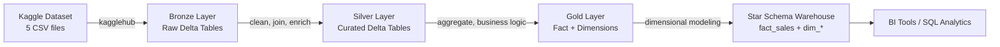
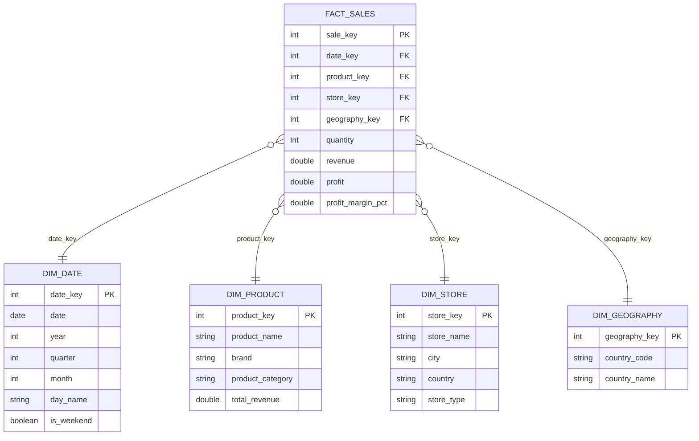

# Chocolate Sales Data Pipeline

An end-to-end **Medallion Architecture** data pipeline built on **Databricks + PySpark + Delta Lake**, transforming raw chocolate sales data into a BI-ready star schema data warehouse.

```
Kaggle CSV → Bronze → Silver → Gold → Star Schema Warehouse → BI / Analytics
```

---

## Overview

This project ingests the [Chocolate Sales Dataset (2023–2024)](https://www.kaggle.com/datasets/ssssws/chocolate-sales-dataset-2023-2024) from Kaggle and processes it through four progressive layers, following the classic **Bronze → Silver → Gold → Warehouse** medallion pattern used in modern lakehouse architectures.

| Layer | Notebook | Schema | Purpose |
|---|---|---|---|
|     Bronze | `bronzechocolate.ipynb` | `workspace.bronze_chocolate` | Raw ingestion, no transformation |
|     Silver | `silverchocolate.ipynb` | `workspace.silver_chocolate` | Cleansing, joins, enrichment |
|     Gold | `goldchocolate.ipynb` | `workspace.gold_chocolate` | Business aggregates & dimensions |
|     Star Schema | `starschemachocolate.ipynb` | `workspace.warehouse_chocolate` | Kimball-style fact/dimension warehouse for BI |

---

##    Architecture



---

##  Bronze Layer — Raw Ingestion

**Notebook:** `bronzechocolate.ipynb`

- Downloads the dataset directly from Kaggle via `kagglehub`
- Loads all 5 source CSVs into Delta tables with **audit columns** (`bronze_ingestion_timestamp`, `bronze_source_file`)
- No transformation — raw data preserved as-is

| Table | Rows | Description |
|---|---:|---|
| `bronze_calendar` | 731 | Date reference table |
| `bronze_products` | 200 | Product catalog |
| `bronze_customers` | 50,000 | Customer master data |
| `bronze_stores` | 100 | Store master data |
| `bronze_sales` | 1,000,000 | Raw transaction-level sales |

---

## 🥈 Silver Layer — Cleansing & Enrichment

**Notebook:** `silverchocolate.ipynb`

- Deduplicates and drops records missing key identifiers (`order_id`, `order_date`, `product_id`)
- Casts and coalesces numeric fields (`quantity`, `unit_price`, `discount`, `revenue`, `cost`, `profit`)
- Enriches sales with product, store, and customer attributes via left joins
- Derives calculated fields: `profit_margin_pct`, `discount_amount`
- Extracts date parts: `year`, `quarter`, `month`, `day`
- Builds conformed dimensions: products, stores, and geography (extracted from country)

| Table | Rows | Columns |
|---|---:|---:|
| `silver_sales` | 1,000,000 | 31 |
| `silver_products` | 202 | 8 |
| `silver_stores` | 100 | 10 |
| `silver_geography` | 6 | 4 |

---

##  Gold Layer — Business Metrics

**Notebook:** `goldchocolate.ipynb`

- Builds a denormalized `gold_fact_sales` table with a surrogate `sale_id`
- Generates a full **date dimension** (`gold_dim_date`) with day names, week of year, weekend flags
- Aggregates **product**, **store**, and **geography** dimensions with rollup metrics: total quantity sold, total revenue, total profit, average profit margin, transaction/customer counts

| Table | Rows | Columns |
|---|---:|---:|
| `gold_fact_sales` | 1,000,000 | 31 |
| `gold_dim_date` | 731 | 12 |
| `gold_dim_product` | 202 | 13 |
| `gold_dim_store` | 100 | 16 |
| `gold_dim_geography` | 6 | 11 |

---

##  Star Schema Warehouse — BI-Ready Model

**Notebook:** `starschemachocolate.ipynb`

Builds a classic **Kimball star schema** from the Gold layer, with surrogate keys (`date_key`, `product_key`, `store_key`, `geography_key`) and a central fact table.



- Loads Gold dimensions and re-keys them with clean surrogate keys
- Joins Gold fact sales to dimensions on natural keys (date, product name, store name, country) to attach surrogate keys
- Validates the model by checking for null foreign keys after the join
- Exports the final fact table to CSV for external BI tool consumption

### Sample analytics query

```sql
SELECT 
    dp.product_category,
    ds.store_name,
    ds.city,
    dg.country_name,
    COUNT(fs.sale_key) AS total_transactions,
    SUM(fs.quantity) AS total_quantity,
    ROUND(SUM(fs.revenue), 2) AS total_revenue,
    ROUND(SUM(fs.profit), 2) AS total_profit,
    ROUND(AVG(fs.profit_margin_pct), 2) AS avg_profit_margin_pct
FROM workspace.warehouse_chocolate.fact_sales fs
INNER JOIN workspace.warehouse_chocolate.dim_product dp ON fs.product_key = dp.product_key
INNER JOIN workspace.warehouse_chocolate.dim_store ds ON fs.store_key = ds.store_key
INNER JOIN workspace.warehouse_chocolate.dim_geography dg ON fs.geography_key = dg.geography_key
GROUP BY dp.product_category, ds.store_name, ds.city, dg.country_name
ORDER BY total_revenue DESC
LIMIT 20
```

---

##  Known Issues

- **Fact table row inflation:** joining on `product_name` / `store_name` (rather than the original surrogate/natural IDs) causes a fan-out during the Star Schema build — `fact_sales` grows from 1,000,000 rows in Gold to ~8,786,033 rows in the warehouse. This points to duplicate name values across products/stores; joining on `product_id` / `store_id` instead would avoid the fan-out.
- **Null `product_key` values:** ~9,764 fact rows fail to match a product dimension key after the join, likely due to name mismatches (casing/whitespace) between `gold_fact_sales.product_name` and `dim_product.product_name`.

---

##  Tech Stack

- **Platform:** Databricks
- **Processing:** PySpark (Spark SQL, DataFrame API, Window functions)
- **Storage format:** Delta Lake
- **Data source:** [Kaggle](https://www.kaggle.com/) via `kagglehub`
- **Language:** Python

---

##  Project Structure

```
├── bronzechocolate.ipynb          # Bronze: raw ingestion from Kaggle
├── silverchocolate.ipynb          # Silver: cleansing, joins, enrichment
├── goldchocolate.ipynb            # Gold: business aggregates & dimensions
└── starschemachocolate.ipynb      # Star Schema: Kimball warehouse for BI
```

---

##  How to Run

1. Import all four notebooks into a Databricks workspace and make sure from volume paths
2. Run `bronzechocolate.ipynb` first — it downloads the source CSVs from Kaggle and creates the `bronze_chocolate` schema/tables.
3. Run `silverchocolate.ipynb` — reads from `bronze_chocolate`, writes to `silver_chocolate`.
4. Run `goldchocolate.ipynb` — reads from `silver_chocolate`, writes to `gold_chocolate`.
5. Run `starschemachocolate.ipynb` — reads from `gold_chocolate`, builds the final `warehouse_chocolate` star schema and exports `fact_sales.csv`.

> Each notebook is self-contained and creates its target schema if it doesn't already exist.

---

##  Final Warehouse Summary

| Object | Rows |
|---|---:|
| `fact_sales` | 8,786,033 |
| `dim_date` | 731 |
| `dim_product` | 202 |
| `dim_store` | 100 |
| `dim_geography` | 6 |
